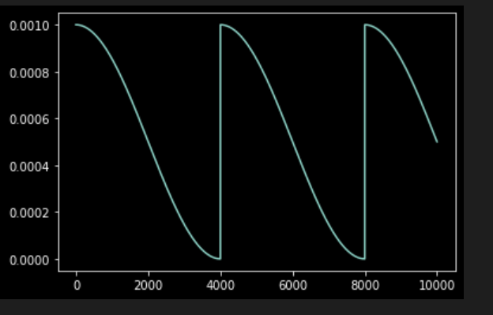

1.os.getcwd()与os.path.abspath(os.curdir)等价 返回当前执行程序所在文件夹

2.resume训练时 scheduler和optimizer最好都load(其实经过实验只load optimizer也可以)

3.scheduler每个batch都需要step

```
net = nn.Linear(10, 1)

optimizer = torch.optim.SGD(net.parameters(), lr = 1e-3)

\# scheduler = get_cosine_schedule_with_warmup(optimizer, num_warmup_steps=2000, num_training_steps=5000, last_epoch=-1)

scheduler = torch.optim.lr_scheduler.CosineAnnealingWarmRestarts(

  optimizer, T_0=4, eta_min=1e-9)
```


```
total_steps = 1000

x = []

y = []

st_epoch = 0

\# resume_F = r"envirion.pt"

resume_F = None


if resume_F is not None:

  chkp = torch.load(resume_F)

  x = chkp["x"]

  y = chkp["y"]

  st_epoch = chkp["epoch"]

  optimizer.load_state_dict(chkp["optim"])

  scheduler.load_state_dict(chkp["scheduler"])


if resume_F is not None:

  chkp = torch.load(resume_F)

  x = chkp["x"]

  y = chkp["y"]

  st_epoch = chkp["epoch"]

  optimizer.load_state_dict(chkp["optim"])

  scheduler.load_state_dict(chkp["scheduler"])

  

for epoch in range(st_epoch, 10):

  for step in range(total_steps):

​    lrv = optimizer.state_dict()['param_groups'][0]['lr']

​    optimizer.step()

​    scheduler.step(epoch + step/total_steps)

​    x.append(epoch * total_steps + step)

​    y.append(lrv)

  if (epoch+1) % 2 == 0:

​    chkp = {

​      "optim": optimizer.state_dict(),

​      "scheduler": scheduler.state_dict(),

​      "x": x,

​      "y": y,

​      "epoch":epoch + 1

​    }

​    torch.save(chkp, "envirion.pt")

​    break

plot(x, y)
```



学习率调整策略: https://codeantenna.com/a/aaxBtRh7ZO

输出学习率方法：
1. scheduler.get_last_lr()[0]
2.optimizer.state_dict()['param_groups'][0]['lr']